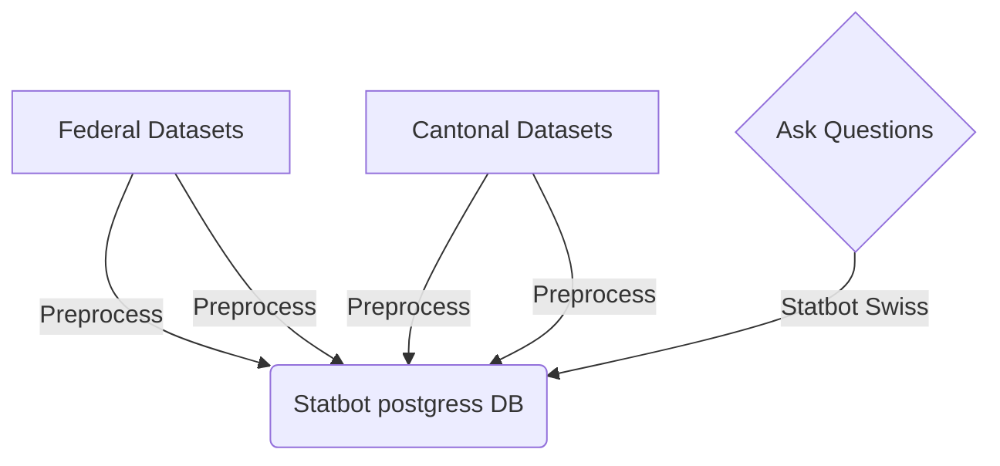
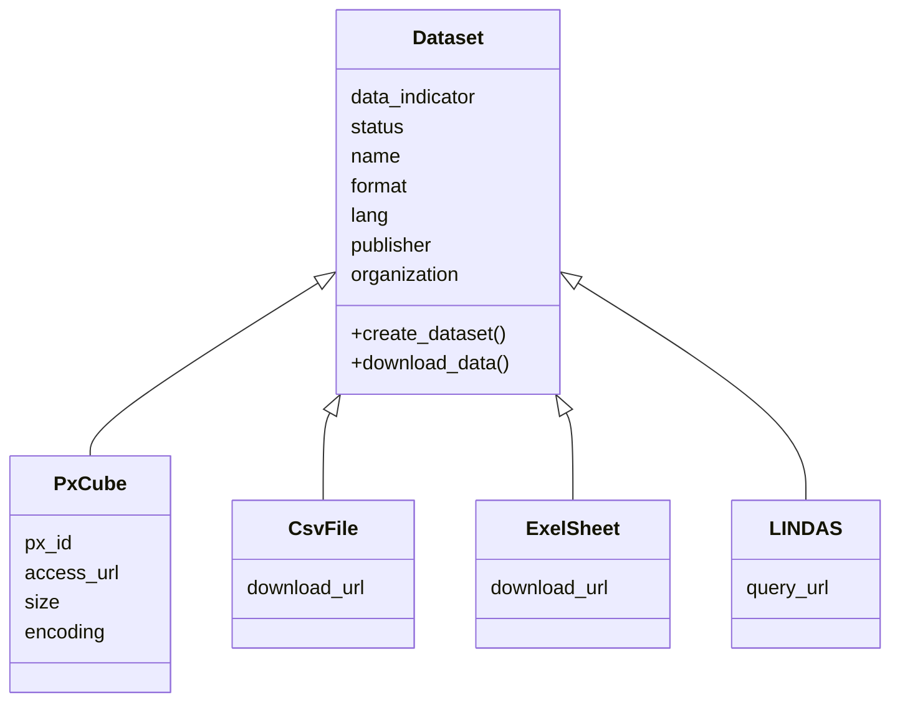

# statbotData

## The project
This repo is part of the [Statbot Swiss Project](https://www.bfs.admin.ch/bfs/de/home/dscc/blog/2023-02-statbot.html). The project has following parts: 
- **[Statbot Postgres DB](#statbot-postgres-db)**: A Postgres DB that is filled with open data from Swiss Statistical offices (Federal Office of Statistics and selected Cantonal Statistical Offices) 
- **[Statbot Training Data](#statbot-training-data)**: Training and test data for the [Statbot Chatbot](#statbot-chatbot), see below.
- **[Statbot Chatbot](#statbot-chatbot)**: An ML Model for a Chatbot that turns questions into sql queries in order to derive answers to these questions by running the sql queries on the [Statbot Postgres DB](#statbot-postgres-db). It uses the [Statbot Training Data](#statbot-training-data) for its model training.

This repo takes care of the following two tasks: 
- it provides functions and pipelines to fill and update the [Statbot Postgres DB](#statbot-postgres-db)

- it provides questions and queries as [Statbot Training Data](#statbot-training-data) for the [Statbot Chatbot](#statbot-chatbot):




## Content of the repo

The repo consists of the following parts:
- **input datasets**: contains the list input datasets for the pipelines and also a list of Swiss adminstative units, that are linked to each dataset
- **R package `statbotData`**: the functions in the directory `R` make up a R package of reusable functions, that are used throughout the pipelines and scripts 
- **pipelines** per **dataset**: they contain scripts for downloading datasets from its origin and preprocessing it for the postgres integration into Statbot Postgres DB](#statbot-postgres-db). They also include other files that relate to the dataset such as the [Statbot Training Data].
- **scripts**: the scripts directory contains sample scripts that can be used to do chores on the datasets and pipelines, such as uploading the dataset and its metadata to the Statbot Postgres DB](#statbot-postgres-db)
- **app**: `app.R` is a local shiny app that gives an overview about the repo and its pipelines: this app is only meant to support the development process and is not deployed anywhere

## Statbot input data

The `data/const` directory consists of two files:
- `statbot_input_data.csv`: this is a csv file of all the datasets that have been uploaded to Statbot Postgres DB
- `spatial_unit_postgres.csv`: this is a csv file for Swiss adminstrative units. It corresponds to the table `spatial_unit` in the  Statbot Postgres DB. 

### Dataset Input Data

The statbot input data `statbot_input_data.csv` describes datasets that are available as opendata and have the following properties: 



**mandatory properties**:
- `data_indicator`: an identifier for the dataset pipeline such as `A1`: this identifier serves also the directory name for the pipeline files in the repo
- `status`: only the status `uploaded` is relevant and indicates that the dataset is already in postgres, any other status can be chosen as needed.
- `name`: the table name in postgres for this dataset 
- `format`: the format determines how the data is retrieved from its origin: `px`, `csv`, `xlsx`, `rdf` are the current options
- `lang`: the language of the dataset, currently this can be either `en`, `de` or `fr`
- `publisher`: the publisher of the dataset
- `organization`: the organization that the dataset belongs to

**Optional properties for the px file format**:
for the [px file format](https://www.scb.se/en/services/statistical-programs-for-px-files/px-file-format/) the following parameter needs to be specified:
- `px_id`: id of the px file

Additional optional parameters for this file format are:
- `size`: `large` triggers a different download method for large files
- `encoding`: `UTF-8` or `latin1`: for `large` `px` files the encoding needs to be specified

By default the [R package BFS](https://felixluginbuhl.com/BFS/) is used to retrive the data by default. It gets the data via api calls in batches. In the case of a large dataset the api limit might be an obstacle. Therefore if the dataset is classified as `large` the the package [pxRRead](https://github.com/SDSC-ORD/pxRRead) is used for the download.

**Properties for the data access**:
- `access_url`: url to access the original dataset
- `query_url`: if the format is `rdf`: a url for the SPARQL endpoint is required
- `download_url`: for file format `csv` or `xlsx` the file download url is required

## Statbot Postgres DB
One goal of this repo ist to fill up the [Statbot Postgres DB](#statbot-postgres-db). This database has the following tables:

```mermaid
erDiagram
    metadata_tables
    metadata_table_columns
    dataset_observation }o--|| spatial_unit : spatial_scope
 ```

**dataset**: each dataset is uploaded into exactly one table in [Statbot Postgres DB](#statbot-postgres-db): all tables contain these two columns mandatory:
- `year`: year of the observation
- `spatialunit_uid`: Swiss administrative unit that the observation refers to

Besides these tables, there are extra tables.

**spatial unit table**: contains spatial units for all administrative units in Switzerland. `spatialinit_uid` is the primary key in that table. The `spatialunit_uid` column in the dataset tables serves as foreign key in the dataset tables.

**extra metadata_tables**: there are two extra metadata tables: their task is to provide additional metadata to the dataset tables.


- `metadata_table_columns`: contains descriptions of all table columns except `spatialunit_uid` and `year`
- `metadata_tables`: contains metadata on the dataset itself.

**metadata_tables**

This metadata table has the following fields:
- `name`: the name of the table in postgres
- `language`: language of the dataset that was used for the postgres import
- `last_pipeline_run`: date when the dataset was last imported from its source
- `data_source_url`: access url of the dataset source
- `title`: title of the dataset in the language of the dataset
- `title_en`: title of the dataset in English
- `description`: description of the table in the language of the dataset
- `description_en`: description of the table in English
- `temporal_coverage`: year from to
- `update_frequency`: update frequency as in [EU frequency vocabulary](https://op.europa.eu/en/web/eu-vocabularies/dataset/-/resource?uri=http://publications.europa.eu/resource/dataset/frequency)
- `spatial_coverage`: spatial coverage: canton or country for example

**metadata_table_columns**

This metadata table has the following fields:
- `name`: name of the column in the table
- `table_name`: name of the postgres table the column belongs to
- `data_type`: either `numeric` or `categorical` 
- `title`: Title of the column in the datasets language
- `title_en`: English translation of the column title  
- `example_values`: 3 to five example values in this column

## Statbot Training Data

The statbot training data consists of questions in natural language and the corresponding 
sql queries. The queries relate to a single input dataset that has been uploaded to the [Statbot Postgres DB](#statbot-postgres-db). The queries don't have joins instead of one possible join on the `spatial_unit` table.

Below is an examples for the Statbot Training Data:

```
-- Wieviele Abstimmungsvorlagen gab es im Jahr 2000?
SELECT COUNT(*) as anzahl_abstimmungsvorlagen_im_jahr_2000
FROM abstimmungsvorlagen_seit_1971 as T
JOIN spatial_unit as S on T.spatialunit_uid = S.spatialunit_uid
WHERE S.name_de='Schweiz' AND S.country=TRUE AND T.jahr=2000;

-- Wieviele Abstimmungsvorlagen gab es seit dem Jahr 1971?
SELECT COUNT(*) as anzahl_abstimmungsvorlagen
FROM abstimmungsvorlagen_seit_1971 as T
JOIN spatial_unit as S on T.spatialunit_uid = S.spatialunit_uid
WHERE S.name_de='Schweiz' AND S.country=TRUE;
```

## Statbot Chatbot

The Chatbot is not yet publically available and currently under active development. 
More information on this part of the project will be added later.

## The Pipelines

The pipelines are intended to process datasets, that have been selected in the input dataset list `statbot_input_data.csv` and prepare them for the [Statbot Postgres DB](#statbot-postgres-db). Besides the dataset preprosessing script the pipeline directory also contains the training data as [Statbot Training Data](#statbot-training-data)

### Content of the pipelines

Each pipeline has a directory in `pipelines` by the name of the `data_indicator` (from the input data). It consists of the following files:

- `<data_indicator>.R`: a script for downloading a dataset, processing it and preparing it for the postgres export 
- `metadata_table_columns.csv`: metadata for the postgres table, describing the fields, besides `year` and `spatialunit_uid``
- `metadata_tables.csv`: metadata for the postgres_table
- `queries.sql`: Natural language questions and corresponding sql queries to answer these questions. This is the [Statbot Training Data]
- `queries.log`: Log of the latest run of the sql queries either locally on the ds$postgres_export` or remote on the postgres database
- `sample.csv`: sample of `ds$postgres_export` as csv file

### Working on the pipelines

To work on a pipeline, open the file `<data_indicator>.R` and run the pipeline, adjust where needed. Once you are happy with `ds$postgres_export` you can open a script in the `scripts` directory to upload the dataset to postgres.

### More details on the file types in the pipelines

#### `queries.sql`

The `queries.sql` files contain the [Statbot Training Data](#statbot-training-data) for each dataset. See this section for a detailed description of these files.

#### `queries.log`

These files are the output of a run of `statbotData::testrun_queries(ds)` on the queries in the `queries.sql` file of the dataset. A datatime indicates the datetime of the run. It contains also information whether the file was run on the remote postgres instance  `REMOTE` or on the local `ds$postgres` data frame.

#### `metadata_tables.csv`

These are metadata for a table in postgres. They are loaded into the postgres metadata table `metadata_tables`, see section on the [Statbot Postgres DB](#statbot-postgres-db) above. 

#### `metadata_table_columns_.csv`

These are metadata for the table columns in postgres. They are loaded into the postgres metadata table `metadata_table_columns`, see [Statbot Postgres DB](#statbot-postgres-db) for details. 

## Scripts

Originally the repo did not have a scripts directory and all the work like test running the queries and uploading metadata and data to postgres had been done directly in the pipelines. 

But the code for these choires is always the same and consists of using the appropriate functions of the package `statbotData`. It does not depend on the specific pipeline or dataset, but on the situation and the status of the dataset. Therefore this code has been extracted from the pipelines and put into a directory of its own with a selection of different sample scripts that relate to certain scenarios: 

- `scripts/upload_new_dataset.R`: for uploading a new dataset with its metadata 
- `scripts/dataset_in_postgres.R`: for testrunning queries for a dataset as part of the [Statbot Training Data](#statbot-training-data) and checking its metadata
- `scripts/update_existing_dataset.R`: for updating a dataset and its metadata on postgres in case the dataset has changed at its origin (a new release of the dataset might have been published with an additional year of statistics added for example)
- `scripts/operate_on_db.R`: for checking on the [Statbot Postgres DB](#statbot-postgres-db): listing its tables and checking on metadata for the tables 

## Access to the Statbot Postgres DB

In order to run the functions, pipelines and scripts in this repo access to the [Statbot Postgres DB](#statbot-postgres-db) is needed. This access is set up via an environment file: 
```
cp sample.env .env
```
Afterwards you need to fill in your credentials into the `.env` file. Otherwise all fuctions that need postgres access won't work.

## `StatbotData` package

The functions of the statbotData package consist of reusable functions that are used in the pipelines, the app and the scripts. There are man pages for the package, that explain the usage and arguments of these functions in more detail. This section will just provide a short overview on these functions.

### Function to create the dataset class

-  `ds <- create_dataset(<data_indicator>)`: this function sets up the dataset class whenever work on a dataset should be done. This must always be done first.

### Functions for data download and preprocessing

-  `download_data`: this function downloads the data for a dataset from its source. The chosen download method depends on the properties of the dataset in `statbot_input_data.csv`, see section on the input data above.

### Functions to run if `ds$postgres_export` has been generated

`ds$postgres_export` is the processed dataset that can be uploaded to the postgres instance Statbot Postgres DB](#statbot-postgres-db). To build this is the goal of each of the pipelines. Certain function in `statbotData` perform operations on this tibble, in case the dataset is not yet in the status `uploaded`:

- `statbotData::dataset_sample`: this function generates a sample of the dataset from `ds$postgres_export`
- `statbotData::testrun_queries`: this runs the queries from a file `queries.sql` in the pipeline directory `ds$dir` and writes a logfile `queries.log` into the same directory
- `statbotData::generate_metadata_templates`: generate templates for the metadata files that are needed to upload metadata on the dataset to postgres
- `statbotData::update_pipeline_last_run_date`: update the `pipeline_last_run` property in the metadata_tables on file; this should be done whenever the dataset has been rebuild from its origin and is uploaded to postgres
- `statbotData:read_metadata_tables_from_file`: checks the metadata and reads them from file. This should be checked before the metadata is uploaded to postgres

### Functions that run on the remote postgres instance and concern one dataset

- `statbotData::create_postgres_table`: this uploads the data frame `ds$postgres` to postgres. `ds$postgres` is build by the [pipelines](#the-pipelines) for the dataset
- `statbotData::update_metadata_in_postgres`: this uploads the metadata on file to postgres. Make sure the metadata are not there yet before this function is run for a dataset, otherwise delete the metadata for the table first
- `statbotData::testrun_queries`: this runs the queries on postgres once the dataset status has been set to `uploaded` in the in the [statbot input data](#statbot-input-data)

### Functions that run on the remote postgres instance and concern one postgres table

- `statbotData::delete_table_in_postgres`: delete a table in postgres
- `statbotData::delete_metadata_from_postgres`: delete the metadata for a table in postgres

### Functions for listing content of the remote postgres instance

- `statbotData::list_tables_in_statbot_db`: lists all tables in postgres
- `statbotData::list_tables_with_metadata_in_statbot_db`: lists all tables that have metadata in postgres
- `statbotData::load_dataset_list` lists the [statbot input data](#statbot-input-data)

### Functions for the mappings of spatial units

- `statbotData::map_ds_spatial_units`: maps cantons and country
- `statbotData::map_ds_municipalities`: maps municipalities
- `statbotData::map_ds_residential_areas`: maps residential areas

## Shiny App

The repo also contains an app: `app.R`:
It can be started from R studio and provides an overview over all elements in the repo:
- the status of the [pipelines](#the-pipelines): whether a dataset has already been uploaded to [Statbot Postgres DB](#statbot-postgres-db)
- the list of the [statbot input datasets](#statbot-input-data)
- the queries as [statbot training data](#statbot-training-data)
- samples of the datasets
